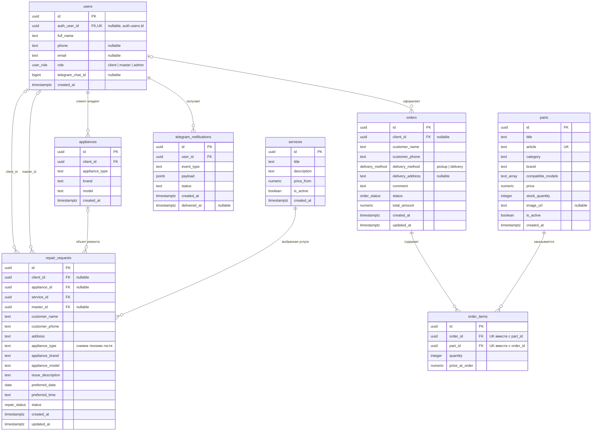

# Реляционная модель «ТехноМастер»

Восемь прикладных таблиц находятся в схеме `public`. Обозначения: `PK` — первичный ключ, `FK` — внешний, `UK` — уникальное значение; `||` — ровно один, `o|` — ноль или один, `o{` — ноль или много, `|{` — один или много.

`auth.users` — служебная таблица Supabase Auth, не восьмая прикладная сущность. Необязательный `users.auth_user_id` связывает профиль сотрудника с его входом. Учебные профили можно создать до учётных записей Auth. FK с UNIQUE означает связь 0..1 профиля с одной учётной записью.

Гость создаёт заявку без регистрации (`client_id` и `appliance_id` равны NULL). Чтобы не потерять тип, марку и модель, заявка хранит снимок этих полей. После регистрации `appliances` может использоваться как справочник техники клиента. FK не заменяет проверку ролей: триггер заявки проверяет, что `master_id` относится к мастеру, `client_id` — к клиенту, а техника принадлежит указанному клиенту.

Допустимые статусы ремонта: `new`, `confirmed`, `assigned`, `in_progress`, `waiting_part`, `completed`, `cancelled`. У заказа: `new`, `confirmed`, `paid`, `completed`, `cancelled`. В назначенных, выполняемых и завершённых заявках мастер обязателен.

Цены, сумма заказа и остатки неотрицательны; количество позиции строго положительно. `article` уникален. Одна деталь встречается в одном заказе один раз. Оформление заказа выполняется функцией `create_order`: она в одной транзакции проверяет остаток, фиксирует цену позиции и уменьшает остаток детали.

Индексы: статус заявки, дата создания, дата визита, FK, категория детали и очередь Telegram; UNIQUE автоматически индексирует артикул. `updated_at` меняется триггером при UPDATE заявки и заказа. Удаление справочных записей с зависимыми данными блокируется RESTRICT; позиции заказа удаляются вместе с заказом (CASCADE).

RLS: анонимно читаются только активные услуги и запчасти. Пользователь Auth может прочитать только свой профиль и не может изменить роль. Запись заявки и заказ идут через сервер с service role; административный и мастерский список требуют валидный JWT и соответствующую роль, проверенную на сервере. `telegram_notifications` — внутренняя очередь без доступа из браузера; бот будет забирать из неё события после подключения токена.
